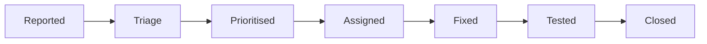
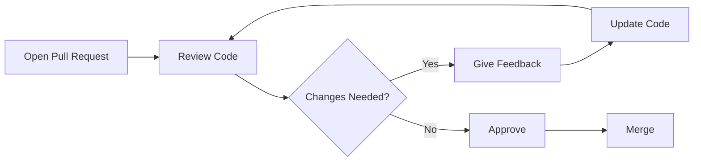
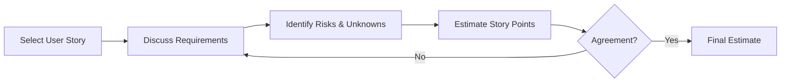

## Bug Lifecycle 

```mermaid
flowchart LR
A[Reported] --> B[Triage]
B --> C[Prioritised]
C --> D[Assigned]
D --> E[Fixed]
E --> F[Tested]
F --> G[Closed]
```

## Code Review Process 

```mermaid
flowchart LR
    A[Open Pull Request] --> B[Review Code]
    B --> C{Changes Needed?}
    C -- Yes --> D[Give Feedback]
    D --> E[Update Code]
    E --> B
    C -- No --> F[Approve]
    F --> G[Merge]
```

## Task Estimation Process 

```mermaid
flowchart LR
A[Select User Story] --> B[Discuss Requirements]
  B --> C[Identify Risks & Unknowns]
    C --> D[Estimate Story Points]
    D --> E{Agreement?}
    E -- No --> B
    E -- Yes --> F[Final Estimate]
```

