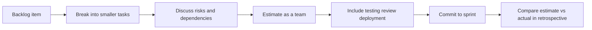

# Task Estimation in Scrum

## Purpose

Task estimation helps the team make realistic sprint commitments by discussing effort, complexity, and uncertainty before work begins. In Scrum, estimation is not about predicting the future with perfect accuracy. It is about building a shared understanding of the work so that the team can plan sensibly, identify risks early, and avoid overcommitting.

For a fast-moving startup, weak estimation causes predictable problems: overloaded sprints, unfinished work, rushed testing, missed deadlines, and defects reaching production. Good estimation reduces these risks by forcing the team to talk about assumptions before implementation starts.

---

## What Task Estimation Means in Our Team

At this company, estimation is a planning tool, not a performance target. Estimates help us decide what is realistic for a sprint and where the biggest risks are. The most useful part of estimation is often the conversation itself, because it reveals hidden work, unclear requirements, risky dependencies, and different assumptions between engineers.

We use **relative sizing** such as story points to compare tasks against one another. We do **not** treat story points as direct hour conversions. A 5-point story is simply understood to be larger, riskier, or more complex than a 2-point story.

---

## Team Standard for Estimation

Our team will follow these rules:

- Estimate backlog items collaboratively during refinement or sprint planning
- Use story points for relative sizing rather than converting points directly into hours
- Break large or unclear items into smaller tasks before committing them to a sprint
- Include testing, code review, integration, deployment, and coordination effort in every estimate
- Highlight assumptions, blockers, and dependencies before agreeing on an estimate
- Revisit estimates when requirements or scope change
- Review estimate accuracy in retrospectives so the team improves over time

---

## Estimation Flow

---

## Best Practices for Task Estimation

- Break work down into the smallest meaningful unit that can be discussed clearly
- Estimate as a team so different perspectives expose hidden complexity
- Use relative sizing to compare effort instead of pretending every task can be timed exactly
- Include the full delivery cycle: coding, testing, bug fixing, code review, deployment, and documentation
- Use Planning Poker or a similar approach so people think independently before discussion
- Record assumptions and risks alongside the estimate
- Use ranges or flag uncertainty when the work is exploratory
- Compare with similar completed work from previous sprints
- Treat estimates as forecasts that may change when new information appears
- Review past estimates against actual outcomes to improve future sprint planning

---

## Bad Practices to Avoid

- Letting one senior engineer estimate everything alone
- Estimating only implementation time and ignoring testing, review, and release work
- Turning story points into hidden hour estimates
- Treating an estimate as a promise rather than a best current forecast
- Estimating large, vague stories without first breaking them down
- Rushing estimation discussions just to get planning finished
- Ignoring dependencies on other teams, services, tools, or approvals
- Assuming familiar work is automatically low-risk
- Never checking whether previous estimates were accurate
- Using estimation to judge individual developer productivity

---

## Estimation Checklist

Before agreeing an estimate, ask:

- Is the work small enough to estimate confidently?
- Does everyone understand the goal and acceptance criteria?
- Have testing, code review, deployment, and integration been included?
- Are there any unknowns, risks, or dependencies?
- Has each team member had a chance to estimate independently?
- Are we using previous similar tasks as a reference point?
- Are we clear that this estimate may change if the scope changes?
- Would this item be safer to split into smaller pieces?

---

## Why Task Estimation Matters for Our Startup

In a team of 20 engineers, poor estimation does more than affect one task. It creates a ripple effect across the sprint. Underestimated work leads to unfinished stories, rushed testing, delayed reviews, and pressure to cut corners near the end of the sprint. Over time, this reduces trust in sprint planning and makes delivery feel unpredictable.

Good estimation improves software quality because it creates space for the work that often gets forgotten: testing, debugging, review cycles, integration issues, and deployment effort. It also improves communication between engineers and stakeholders by making trade-offs visible early. When the team openly discusses uncertainty, it becomes easier to adjust scope before the sprint is overloaded.

Estimation should therefore be seen as a quality practice, not just a planning ritual. Better estimates lead to more realistic sprint goals, less last-minute pressure, and fewer defects caused by rushed or incomplete work.

---

## Good vs Bad Estimation

| Good estimation | Bad estimation |
|---|---|
| Team discussion before assigning a size | One person guesses the number alone |
| Small, clearly defined work items | Large, vague stories with unclear scope |
| Includes testing, review, and deployment | Only counts coding time |
| Risks and dependencies are discussed | Hidden blockers are ignored |
| Relative sizing based on comparison | Story points secretly converted into hours |
| Estimate reviewed when scope changes | Original estimate treated as fixed forever |

---

## Common Themes from the Research

Across the sources, the most consistent message is that estimation is less about predicting exact duration and more about exposing uncertainty, assumptions, and hidden work.

| Theme | What it means for us |
|---|---|
| Engineers usually underestimate work | Treat first estimates cautiously and avoid overcommitting |
| Unknowns dominate software tasks | Break work down until risks become visible |
| Non-coding effort is often forgotten | Always include testing, review, deployment, and coordination |
| Story points only work when shared consistently | Agree as a team what different sizes roughly mean |
| Estimates are forecasts, not promises | Update estimates when scope or knowledge changes |
| Discussion matters more than the number | Use estimation to surface assumptions early |

---

## Further Reading

1. **Sean Goedecke – How I Estimate Work as a Staff Software Engineer**  
   https://www.seangoedecke.com/how-i-estimate-work/

2. **Arpit Bhayani – We Engineers Suck at Task Estimation**  
   https://arpitbhayani.me/blogs/we-engineers-suck-at-task-estimation/

3. **Vadim Kravcenko – Rules of Thumb for Software Development Estimations**  
   https://vadimkravcenko.com/shorts/project-estimates/

4. **Uplevel – Story Point Estimation Doesn't Work. Here's Why.**  
   https://uplevelteam.com/blog/story-point-estimation

5. **Mountain Goat Software – Why Do We Estimate With Story Points Instead of Hours?**  
   https://www.mountaingoatsoftware.com/blog/why-do-we-estimate-with-story-points-instead-of-hours
